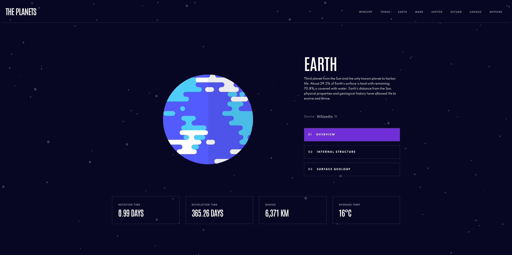

# Frontend Mentor - Planets fact site solution

This is a solution to the [Planets fact site challenge on Frontend Mentor](https://www.frontendmentor.io/challenges/planets-fact-site-gazqN8w_f). Frontend Mentor challenges help you improve your coding skills by building realistic projects. 

## Table of contents

- [Overview](#overview)
  - [The challenge](#the-challenge)
  - [Screenshot](#screenshot)
  - [Links](#links)
- [My process](#my-process)
  - [Built with](#built-with)
- [Author](#author)

## Overview

### The challenge

Users should be able to:

- View the optimal layout for the app depending on their device's screen size
- See hover states for all interactive elements on the page
- View each planet page and toggle between "Overview", "Internal Structure", and "Surface Geology"

### Screenshot

### Links

- Solution URL: [Github](https://github.com/MattDev97/fem-planets-fact-site)
- Live Site URL: [Github Pages](https://mattdev97.github.io/fem-planets-fact-site/)

## My process

### Built with

- [React](https://reactjs.org/) - JS library
- [TailwindCSS](https://tailwindcss.com/) - React framework

## Author

- Linkedin - [Matthew Muenzberg](https://www.linkedin.com/in/matthew-muenzberg-225311162/)
- Frontend Mentor - [@MattDev97](https://www.frontendmentor.io/profile/MattDev97)

